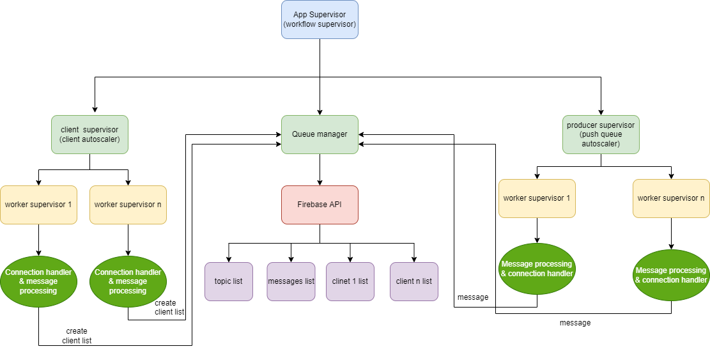

**Message broker**

> The main purpose of a message broker is to separate messages from a
> data stream by topics

and send it to the clients that are subscribed to those topics.

{width="6.370833333333334in"
height="4.540276684164479in"}

Figure 1. Posts flow from publisher to subscriber

In the figure above is illustrated data flow in general terms. Each
publisher posts a stream of data which is separated in the message
broker (MOM) by topic and is stored in queue (each topic- a separate
queue).

{width="6.480555555555555in"
height="2.7138877952755904in"}

Figure 2. Message broker supervision tree

> The supervision tree represents which actor creates/supervises other
> actors, for example, client supervisor has a role to create an actor
> (worker supervisor in the scheme) for each new client connection,
> which at his turn creates 2 workers, one which handles connection and
> message exchange between client and broker and the other one which
> extracts messages from the subscribed topic and hands it over to first
> worker.

{width="6.623611111111111in"
height="4.347222222222222in"}

Figure 3. Data flow

When data is received from a publisher by the broker, the actor that
handles publisher connection (push queue autoscaler), it automatically
creates an actor (worker supervisor) with 2 workers, one of which
handles connection and receives messages from the published after which
it handles it over to the second worker which separates the data stream
by topics to separate queues. If there is no such queue for the current
message topic that is parsed, message processing worker notifies queue
manager to create new queue with the current topic

When a client initializes a connection to get messages, the main actor
(workflow supervisor) notifies client autoscaler to create a new actor
that will create a worker supervisor with 2 workers which will handle
the connection and message exchange with the client, and the other one
that will get messages from subscribed queues and hand it over back to
the client connection handler in order to be sent to the client.
